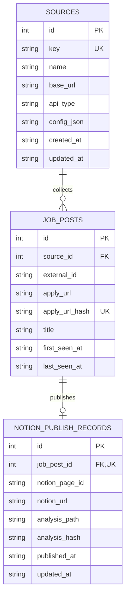

# employment-scheduler


## 개요

`employment-scheduler`는 채용 공고 수집, 지원 URL 정규화, Codex 기반 지원 페이지 분석, Notion 게시까지 이어지는 로컬 Python CLI 파이프라인입니다.

현재 구현은 `inthiswork` WordPress REST API에서 IT 채용 공고를 수집하고, `지원하러 가기` 링크를 정규화해 SQLite에 저장합니다. 이후 저장된 `job_posts.apply_url`을 대상으로 Codex 분석 리포트를 만들고, 필요한 경우 Notion 페이지로 게시한 이력을 함께 관리합니다.

기본 로컬 데이터 경로는 다음과 같습니다.

- SQLite DB: `data/employment.sqlite`
- 분석 리포트: `data/analysis/apply_urls/`
- 원천 데이터 보관 위치: `data/raw/`

## Quickstart

### Installing and Running Python CLI

Python 3.12 이상을 사용합니다.

```bash
python -m pip install -e ".[dev]"
```

채용 공고를 수집합니다. `--date`는 수집 기준일이며, 현재 `inthiswork` 수집기는 기준일의 전날부터 기준일까지의 공고를 조회합니다.

```bash
python scripts/collect.py --source inthiswork --date 2026-06-04
```

저장된 지원 URL을 Codex CLI로 분석합니다. 분석 결과는 기본적으로 `data/analysis/apply_urls/post/<seen-at>/` 아래에 Markdown 파일로 저장됩니다.

```bash
python scripts/analyze.py --source inthiswork --seen-at 2026-06-04 --limit 3
python scripts/analyze.py --source inthiswork --seen-at 2026-06-04 --workers 2
python scripts/analyze.py --source inthiswork --seen-at 2026-06-04 --force
```

분석 리포트를 Notion에 게시하기 전에는 `--dry-run`으로 대상과 작업을 확인할 수 있습니다.

```bash
python scripts/publish.py --seen-at 2026-06-04 --dry-run
```

실제 게시에는 Notion 설정이 필요합니다. `.env` 또는 셸 환경 변수에 `NOTION_API_KEY`와 부모 위치 중 하나를 설정합니다.

```bash
NOTION_API_KEY=secret_...
NOTION_DATA_SOURCE_ID=...
```

그 다음 게시를 실행합니다.

```bash
python scripts/publish.py --seen-at 2026-06-04
```

테스트는 다음 명령으로 실행합니다.

```bash
pytest
```

## DB ERD

현재 스키마의 기준 파일은 `migrations/001_init.sql`입니다.



주요 제약 조건은 다음과 같습니다.

- `sources.key`는 소스 식별자를 유일하게 보관합니다.
- `job_posts.source_id`는 `sources.id`를 참조합니다.
- `job_posts.apply_url_hash`는 정규화된 지원 URL의 중복 저장을 막습니다.
- `job_posts`는 `(source_id, external_id)` 조합도 유일하게 유지합니다.
- `notion_publish_records.job_post_id`는 `job_posts.id`를 참조하며, 한 공고당 하나의 Notion 게시 이력만 저장합니다.
